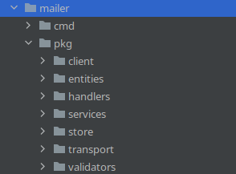

 In this article, we are going to explore how to structure `Go` application and `error` handling.

### 1. Go application architecture
#### /cmd
- This folder contains the main application entry point files for the project, with the directory name matching the name for the binary. So for example cmd/send-email meaning that the binary we publish will be send-email.

#### /pkg
- This folder contains code which is OK for other services to consume, this may include API clients, or utility functions which may be handy for other projects but don’t justify their own project.

### Structure example



### 2. Go error handling
`Go` does not provide conventional try/catch method to handle the `errors` instead, `errors` are returned as a normal return value.

Let's assume that we have API call, that is located in */pkg/handlers/handler.go*
Handler is calling some service function from */pkg/services/service.go*
Service is calling some store method from */pkg/store/store.go*. All functions are returning error as value.
Instead of logging  all errors in every function we should wrap the the error from store.go after that wrap the error in service.go and log the error or handle it in handler.go.

Show me the code talk is cheap. :) 
This should look something like this

```go
func FuncHandler() {
	err := service.FuncService()
	if err != nil {
		log.Errorf("error in handler:%w",err)
	}
}
func FuncService() {
	err := store.FuncStore()
	if err != nil {
		return fmt.Errorf("error in service:%w", err)
	}
}
func FuncStore() {
	err := Query(dosmth)
	if err != nil {
		return fmt.Errorf("error in store:%w", err)
	}
}

````
So if the error occurs in FuncStore and we log the error on FuncHandler the error message will be:

```log
level=error msg="error in handler" error="error in service: error in store: Error:"query error"
```


